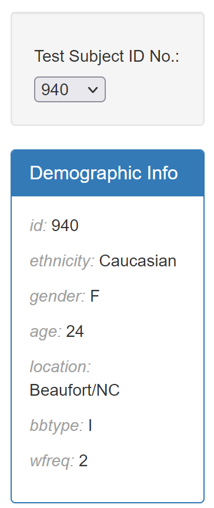
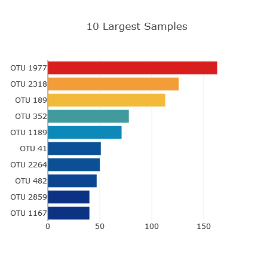
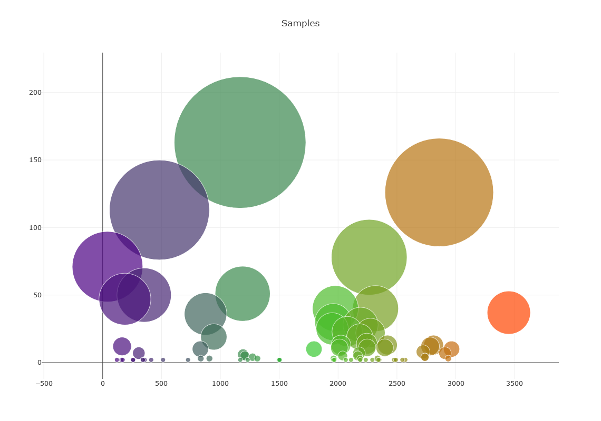
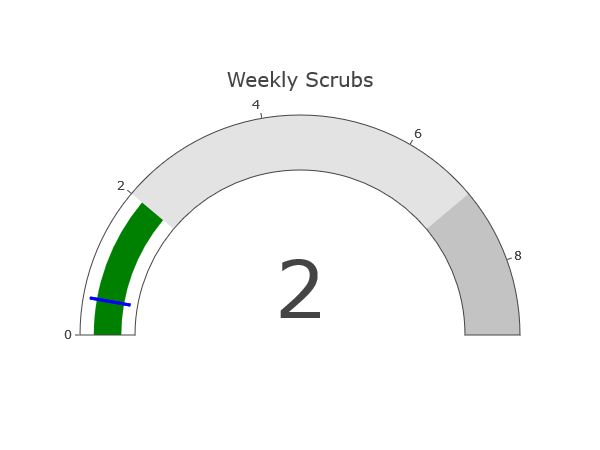

# Plotly-challenge

### Robert Lane

## Overview

The purpose of this project is to use JavaScript to populate a dropdown menu with items loaded from a JSON file (samples.json).  Charts are subsequently rendered using Plotly, and updated each time a new selection is made.

* **Selection & Demographics:**  
This section allows the user to select which test subject to observe.  Upon selection, demographic information is updated accordingly.  <figure><figcaption align = "center"><i>Demographics</i></figcaption></figure> 

* **Horizontal Bar Chart:**  
The bar chart displays the top 10 sample values for OTU IDs in descending order.  Additional details about the individual OTU ID can be obtained by hovering over any of the bars. <figure><figcaption align = "center"><i>Horizontal Bar Chart</i></figcaption></figure> 

* **Bubble Chart:**  
The bubble chart shows relative sample size, and like the previous section, further details about the sample can be obtained by hovering over the bubble.  <figure><figcaption align = "center"><i>Bubble Chart</i></figcaption></figure> 

* **Gauge:**  
The gauge shows information from the subject demographics: weekly frequency of belly button scrubs, and ranges from 0 to 9.  <figure><figcaption align = "center"><i>Gauge</i></figcaption></figure> 

## Files

* README.md  
	* This file.
	
* index.html  
	* Interactive page, including selection dropdown menu, demographic info, horizontal bar chart of 10 largest samples, a gauge indicator for number of scrubs per week, and a bubble scatter plot for all samples collected in the datum.
	
* samples.json  
	* The source for the data in this project.
	
* static/js/app.js  
	* Location for JavaScript file, which contains all logic used for this charting.